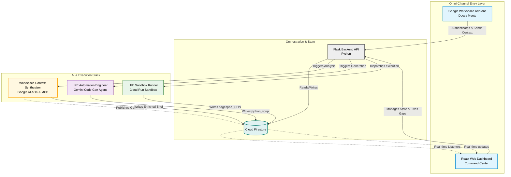

# Workspace Context Synthesizer — Google AI Agents Hackathon (Track 1)

> **Track 1: Build (Net-New Agents)** — Google for Startups AI Agents Challenge

An autonomous AI agent that operates inside Google Workspace to synthesize unstructured client onboarding materials (Google Docs briefings + Google Meet transcripts) into validated, schema-compliant campaign briefs — preventing hallucinations, brand mismatches, and logical gaps before any code generation is attempted.

---

## 🏗️ Architecture



---

## 🧠 Tech Stack

| Layer | Technology |
|---|---|
| **Agent Framework** | [Google Agent Development Kit (ADK)](https://google.github.io/adk-docs/) |
| **Tool Protocol** | [Model Context Protocol (MCP)](https://modelcontextprotocol.io/) |
| **LLM** | Gemini 2.5 Flash |
| **Workspace Integration** | Google Docs API, Google Drive API, Google Calendar API, Google Meet |
| **Google Workspace Add-on** | Apps Script (Sidebar + Onboarding) |
| **Backend** | Python / Flask |
| **Database** | Cloud Firestore (real-time listeners) |
| **Deployment** | Cloud Run (MCP Server), Google Cloud Functions (API) |
| **Storage** | Firebase Cloud Storage (CDN media assets) |

---

## 🔑 Core Capabilities

### 1. Autonomous Context Ingestion
The agent connects to Google Docs and Google Meet transcripts via MCP tools, extracting brand guidelines, copy requirements, and design tokens from unstructured text.

### 2. Anomaly Detection & Contradiction Resolution
Cross-references document and transcript data to flag mismatches (e.g., "Doc says light mode, client said dark mode in the meeting"). Publishes gap flags to Firestore for real-time dashboard alerts.

### 3. Human-in-the-Loop Governance
Detected contradictions surface on the React dashboard where operators resolve them before the downstream code generation pipeline runs — preventing garbage-in-garbage-out.

### 4. Structured Brief Compilation
Outputs a schema-validated JSON Creative Brief mapping directly to the landing page engine's SDK primitives.

### 5. Calendar-Based Meeting-to-Client Mapping
Deterministic meeting-to-client routing via Google Calendar operator controls (no flaky email domain heuristics).

### 6. Smart Transcript Reconciliation
Confidence scoring engine (0-100) combining fuzzy title matching, time delta, and attendee registry checks to auto-suggest transcript-to-meeting matches.

---

## 📁 Project Structure

```
├── src/
│   ├── adk_agent.py                    # ADK agent orchestrator
│   ├── agents/
│   │   └── analyze_agent.py            # Mismatch analysis agent (ADK + MCP)
│   ├── mcp/
│   │   └── workspace_server.py         # MCP server (Google Docs/Drive tools)
│   ├── google_workspace.py             # Google Workspace API integration layer
│   └── media_ingestion.py              # Drive → Firebase Storage media pipeline
├── google-addon/
│   ├── Code.gs                         # Apps Script backend (API bridge)
│   ├── Onboarding.gs                   # Client onboarding & calendar workflows
│   ├── Sidebar.html                    # Add-on sidebar UI
│   └── appsscript.json                 # Apps Script manifest
├── agent_prd.md                        # Product Requirements Document
├── system_design.md                    # Architecture diagrams (Mermaid)
├── decision_flow.md                    # Agent decision tree & state machine
├── golden_dataset.md                   # Ground truth test cases
├── eval_metrics.md                     # Evaluation KPIs
├── api_contracts.md                    # JSON schemas & API contracts
├── mcp_manifest.md                     # MCP tool definitions & scopes
├── system_prompt_charter.md            # System instructions & edge cases
├── Dockerfile                          # Cloud Run containerization
├── deploy_mcp.sh                       # Cloud Run deployment script
└── requirements.txt                    # Python dependencies
```

---

## 🚀 Quick Start

### Prerequisites
- Python 3.11+
- Google Cloud project with Docs, Drive, and Calendar APIs enabled
- Service account with appropriate permissions
- Gemini API key

### Setup
```bash
# Clone the repository
git clone https://github.com/<your-org>/lpe-workspace-agent-public.git
cd lpe-workspace-agent-public

# Create virtual environment
python -m venv .venv && source .venv/bin/activate

# Install dependencies
pip install -r requirements.txt

# Configure environment
cp .env.example .env
# Edit .env with your credentials
```

### Run the MCP Server (Local)
```bash
./run_mcp_server.sh
# Server starts on http://127.0.0.1:9000/sse
```

### Deploy to Cloud Run
```bash
./deploy_mcp.sh
```

---

## 📊 Evaluation Metrics

| Metric | Target | Description |
|---|---|---|
| **Latency** | < 15s | End-to-end from trigger to brief validation |
| **Schema Validation Rate** | 100% | Output must be valid JSON matching API contracts |
| **Anomaly Recall** | > 95% | Must catch nearly all contradictions |
| **Anomaly Precision** | > 90% | Avoid false positive gap flags |
| **Asset Hallucination Rate** | 0% | Never fabricate URLs or brand tokens |

See [eval_metrics.md](./eval_metrics.md) for full details and [golden_dataset.md](./golden_dataset.md) for ground truth test cases.

---

## 📖 Documentation Index

| Document | Purpose |
|---|---|
| [Product Requirements](./agent_prd.md) | Problem statement, goals, anti-goals |
| [System Architecture](./system_design.md) | Mermaid diagrams, data flow, Cloud Run vs ADK rationale |
| [Decision Flow](./decision_flow.md) | Agent state machine & ingestion flow chart |
| [API Contracts](./api_contracts.md) | JSON schemas between agents and APIs |
| [MCP Manifest](./mcp_manifest.md) | Tool definitions, scopes, permissions |
| [System Prompt Charter](./system_prompt_charter.md) | LLM instructions & edge case handling |
| [Golden Dataset](./golden_dataset.md) | Ground truth inputs/outputs for evaluation |
| [Evaluation Metrics](./eval_metrics.md) | KPIs and performance thresholds |

---

## 🛡️ License

This project was built for the [Google for Startups AI Agents Challenge](https://googleforstartups-accelerator.devpost.com/) (Track 1: Build).
