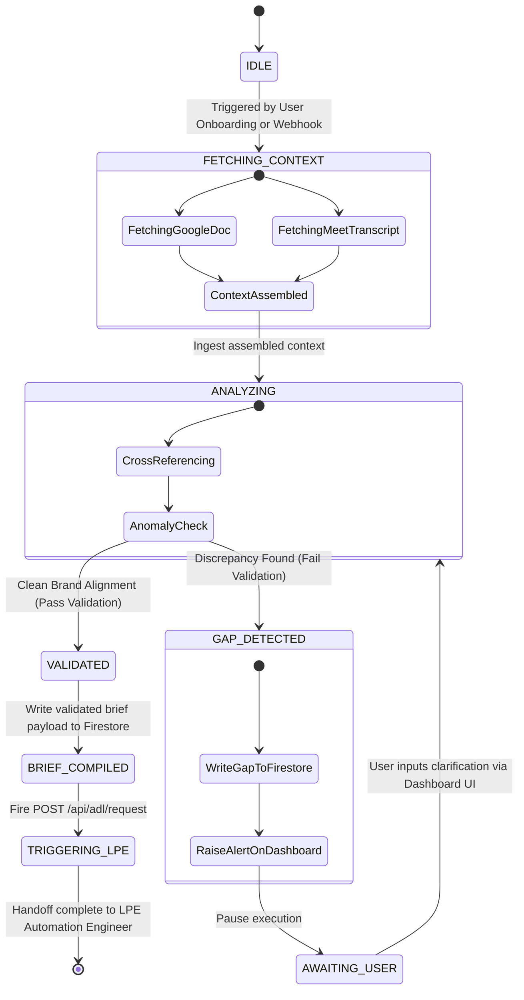

# Agent Decision Flow & State Machine
## Agent Name: Workspace Context Synthesizer (ADK Agent)

This document maps out the state machine, logic flows, and conflict resolution loops for the Workspace Context Synthesizer.

---

## 1. Logical State Diagram

---

## 2. Detailed Logical Transitions

### A. IDLE → FETCHING_CONTEXT
*   **Trigger:** User inputs a Google Doc URL and a Google Meet Recording Space ID in the React Dashboard and clicks "Generate Campaign".
*   **Action:** The backend API spawns the ADK Agent, passing Google Auth credentials.

### B. ANALYZING → GAP_DETECTED
*   **Condition:** The ADK Agent compares the document's copywriting rules with the client's spoken transcript. It detects a color contradiction (e.g., Doc specifies "#4F46E5 Indigo", Transcript specifies "Warm earthy tone palette").
*   **Action:** The agent stops execution, compiles the discrepancy details, calls `write_gap_flag` to Firestore, and sets the document state to `gap_detected`.

### C. AWAITING_USER → ANALYZING
*   **Condition:** The React Dashboard displays the contradiction in the "Autonomous Gaps" tab. The user selects the preferred value (e.g., "Warm Earthy Tones") and submits.
*   **Action:** The dashboard updates the Firestore request document with the clarification. The Flask backend detects this change and re-triggers the ADK Agent to run again with the updated input.

### D. ANALYZING → VALIDATED → BRIEF_COMPILED
*   **Condition:** No gaps are found (or all previously flagged gaps have been resolved).
*   **Action:** The ADK Agent assembles the enriched Creative Brief, calls `write_client_profile` to Firestore, and transitions to `brief_compiled`.

---

## 3. Loop Mitigation (Anti-Infinite Loop Rule)
To prevent the agent from getting stuck in an infinite evaluation loop (e.g., if the user keeps providing ambiguous answers that lead to more gaps):
*   **Limit:** Maximum of **3 gap detection retries** per request.
*   **Escape Route:** If the retry count exceeds 3, the agent halts, marks the state as `manual_intervention_required`, and passes the incomplete brief directly to the dashboard, allowing the agency developer to edit the fields manually.
