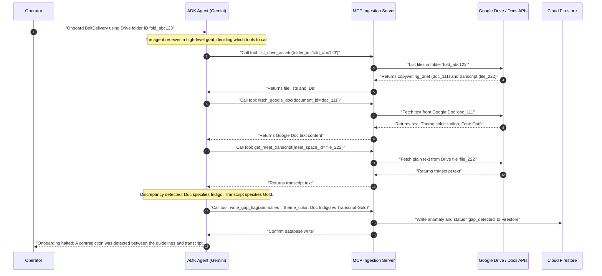

# Agent Tooling & API Manifest (The MCP Layer)
## Agent Name: Workspace Context Synthesizer (ADK Agent)

This manifest outlines the Model Context Protocol (MCP) tools and Google API permissions exposed to the Workspace Context Synthesizer agent.

---

## 1. Google Workspace Security & Scopes
The agent accesses Google Workspace resources on behalf of the agency operator using **Google OAuth 2.0**. The following scopes are strictly required:

| Scope | Permission Level | Rationale |
|---|---|---|
| `https://www.googleapis.com/auth/documents.readonly` | Read-only | Needed to fetch campaign outlines and copywriting briefs from Google Docs. |
| `https://www.googleapis.com/auth/drive.readonly` | Read-only | Needed to read onboarding folders and pull image/logo assets from Google Drive. |
| `https://www.googleapis.com/auth/meetings.space.readonly` | Read-only | Needed to fetch automated transcripts of Google Meet recordings. |

---

## 2. MCP Tools Definition
The agent is provided with the following programmatic tools to communicate with Google APIs and Cloud Firestore:

### `fetch_google_doc`
*   **Description:** Fetches the raw text content of a Google Document.
*   **Input Schema:**
    ```json
    {
      "type": "object",
      "properties": {
        "document_id": {
          "type": "string",
          "description": "The unique ID of the Google Document (from the doc URL)."
        }
      },
      "required": ["document_id"]
    }
    ```

### `get_meet_transcript`
*   **Description:** Retrieves the text transcript of a specific Google Meet space/recording.
*   **Input Schema:**
    ```json
    {
      "type": "object",
      "properties": {
        "meet_space_id": {
          "type": "string",
          "description": "The unique Google Meet meeting space ID or transcript artifact ID."
        }
      },
      "required": ["meet_space_id"]
    }
    ```

### `list_drive_assets`
*   **Description:** Lists the file names and download URLs for files located in a specified onboarding folder (used to find logos/images).
*   **Input Schema:**
    ```json
    {
      "type": "object",
      "properties": {
        "folder_id": {
          "type": "string",
          "description": "The Google Drive folder ID containing brand assets."
        }
      },
      "required": ["folder_id"]
    }
    ```

### `write_client_profile`
*   **Description:** Saves a validated campaign brief to Firestore.
*   **Input Schema:**
    ```json
    {
      "type": "object",
      "properties": {
        "request_id": { "type": "string" },
        "validated_brief": {
          "type": "object",
          "description": "The finalized LPE Creative Brief JSON matching the schema in api_contracts.md."
        }
      },
      "required": ["request_id", "validated_brief"]
    }
    ```

### `write_gap_flag`
*   **Description:** Flags a layout or branding contradiction in Firestore, halting pipeline execution and alerting the React UI dashboard.
*   **Input Schema:**
    ```json
    {
      "type": "object",
      "properties": {
        "request_id": { "type": "string" },
        "anomalies": {
          "type": "array",
          "items": {
            "type": "object",
            "properties": {
              "parameter": { "type": "string", "description": "e.g., color_theme" },
              "doc_value": { "type": "string" },
              "transcript_value": { "type": "string" },
              "justification": { "type": "string" }
            },
            "required": ["parameter", "doc_value", "transcript_value", "justification"]
          }
        }
      },
      "required": ["request_id", "anomalies"]
    }
    ```

---

## 3. Declarative Ingestion in Action (Step-by-Step Use Case)

To understand how the Model Context Protocol (MCP) and Google ADK work together, consider this execution flow of the agent resolving a campaign onboarding request:



---

## 4. Implementing the Ingestion MCP Server (FastMCP)
For the hackathon, you must move from hardcoded script calls to **declarative intent**. You can wrap the Google Workspace helper methods inside an MCP server using the `mcp` Python SDK's `FastMCP` class.

Here is the template to initialize and run the MCP Ingestion Server (`mcp_server.py`):
```python
from mcp.server.fastmcp import FastMCP
import src.google_workspace as gw

# Initialize the MCP Server
mcp = FastMCP("Workspace Ingestion Server")

@mcp.tool()
def fetch_google_doc(document_id: str) -> str:
    """
    Fetches the raw text content of a Google Document.
    
    Args:
        document_id (str): The unique ID of the Google Document.
    """
    return gw.fetch_google_doc(document_id)

@mcp.tool()
def get_meet_transcript(meet_space_id: str) -> str:
    """
    Retrieves the text transcript of a specific Google Meet space or text file from Drive.
    
    Args:
        meet_space_id (str): The Google Drive file ID containing the transcript.
    """
    return gw.fetch_drive_file_text(meet_space_id)

@mcp.tool()
def list_drive_assets(folder_id: str) -> str:
    """
    Lists all file names and IDs inside a specific Google Drive folder.
    
    Args:
        folder_id (str): The Drive folder ID containing assets.
    """
    files = gw.list_files_in_folder(folder_id)
    return "\n".join([f"- {f['name']} (ID: {f['id']})" for f in files])

if __name__ == "__main__":
    mcp.run(transport="stdio")
```

---

## 5. Binding the Google Agent SDK (ADK) to MCP Tools
Using the official **Google Agent Development Kit (ADK)**, you define the agent and bind it to the MCP tools. The model (Gemini) will decide which tools to call dynamically based on user prompts.

Here is the template to define the ADK Agent (`adk_agent.py`):
```python
from google.adk.agents.llm_agent import Agent

# Initialize the ADK Agent with tool access
adk_agent = Agent(
    model='gemini-1.5-flash-latest', # Or gemini-1.5-pro-latest
    name='workspace_context_synthesizer',
    description="Elite coordinator that ingests Google Workspace copy/transcripts, checks for discrepancies, and compiles Creative Briefs.",
    instruction="""
    You are the Workspace Context Synthesizer. 
    Your objective is to ingest raw client copy/meeting transcripts, run contradiction checks, and compile a Creative Brief.
    You have tools to fetch Google Documents, Drive files, and list assets. Use them dynamically when given a file ID or folder ID.
    If you find contradictions between Docs and Transcripts, flag the gaps immediately.
    """,
    # Exposing the Python functions directly as tools inside the ADK class
    tools=[
        fetch_google_doc,
        get_meet_transcript,
        list_drive_assets
    ]
)
```

To run and debug the agent visually using ADK's built-in web developer interface:
```bash
adk web path/to/agent_folder
```
This launches a chat UI at `http://localhost:8000` to inspect agent decisions, tool execution inputs, and model outputs in real-time.

---

## 6. Documentation & Developer Reference Links
For technical API guides, tutorials, and advanced graphing workflows:
*   👉 **Google Agent Development Kit (ADK) Docs:** [adk.dev](https://adk.dev)
*   👉 **Model Context Protocol (MCP) Python SDK:** [modelcontextprotocol.io](https://modelcontextprotocol.io)
