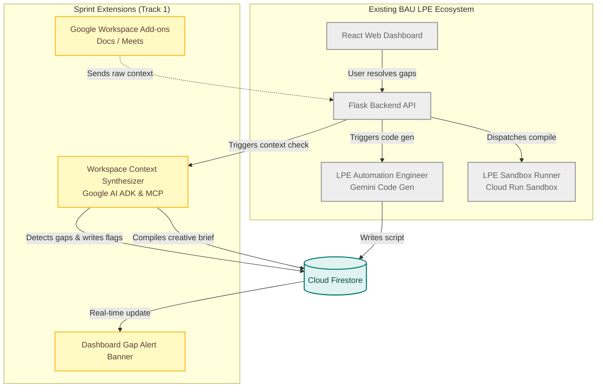
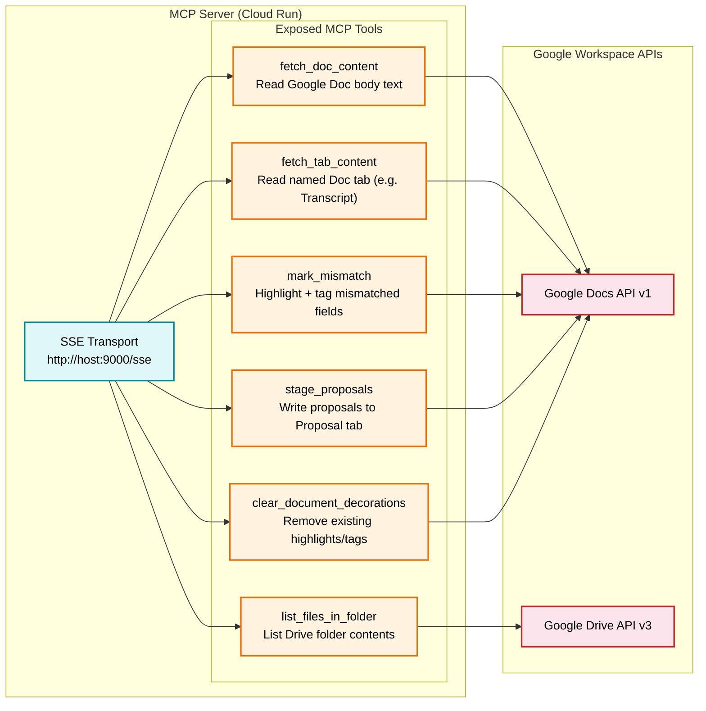
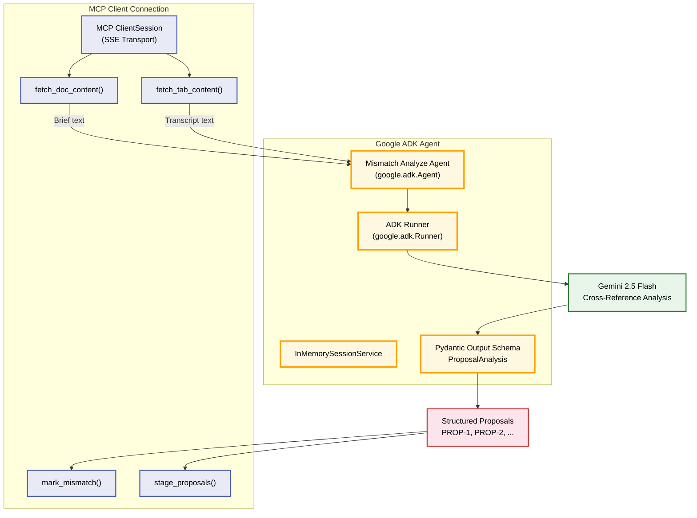
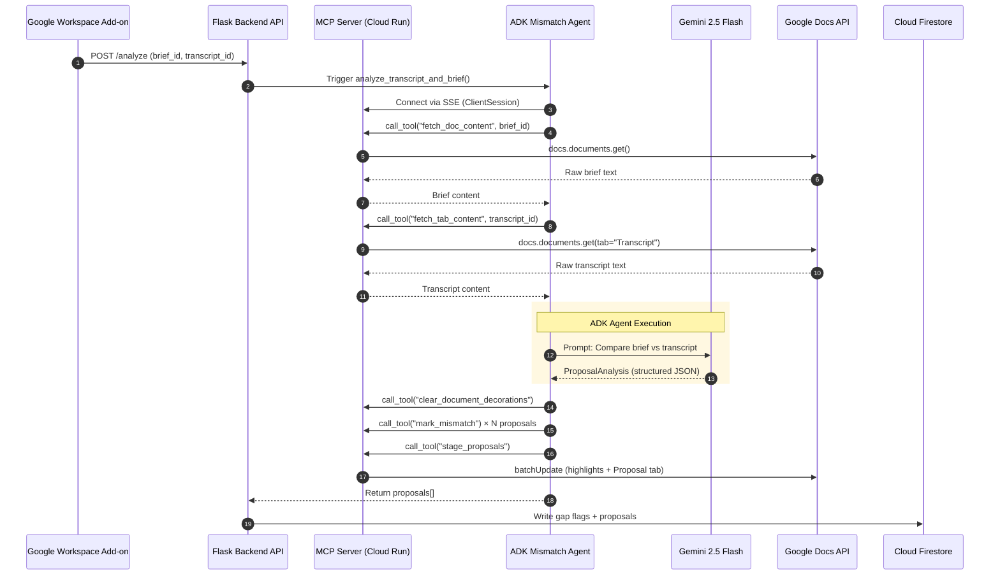
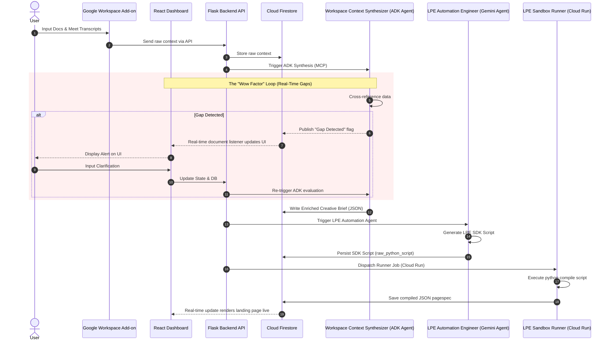
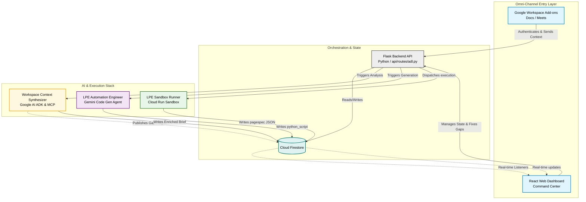

# Hackathon System Design Blueprint

This document outlines the architecture, flow control, and data boundaries of the Workspace Context Synthesizer integration, highlighting how it extends the existing LPE ecosystem.

---

## 1. Ecosystem Extension Map
The diagram below illustrates how this sprint's Track 1 additions (gold/yellow) sit upstream of and extend our existing BAU LPE compilation pipeline (gray).



---

## 2. Commentary & Rationale

*   **Upstream Guardrail (Triage):** In the existing ecosystem, users would write prompts directly in the React Dashboard. If their prompts were incomplete or contradicted the brand guidelines, the LPE generator would produce broken code or mismatched components. This sprint introduces an **upstream guardrail** (the Workspace Context Synthesizer) to validate user and meeting inputs *before* code generation is triggered.
*   **Omni-channel Ingestion:** Instead of forcing agency coordinators to manually type campaign specifications, they can now trigger landing page builds directly from where they gather details (Google Docs and Google Meet transcripts) using Google API and MCP integrations.
*   **Human-in-the-loop (HITL) Refinement:** The extension establishes a real-time Firestore database listener. If the synthesis agent detects conflicting style instructions (e.g. Doc vs. transcript), it flags the contradiction and notifies the React Dashboard. This allows the human operator to resolve design gaps visually before calling the LPE code generator.

---

## 3. ADK + MCP Architecture (Core Hackathon Components)

This section details the two primary frameworks used in this hackathon submission: **Google Agent Development Kit (ADK)** for agent orchestration and **Model Context Protocol (MCP)** for secure, standardized tool access.

### MCP Server — Tool Layer

The MCP Server (`src/mcp/workspace_server.py`) is deployed to **Cloud Run** and exposes Google Workspace APIs as standardized MCP tools over **SSE (Server-Sent Events)** transport:



### ADK Agent — Orchestration Layer

The **Mismatch Analyze Agent** (`src/agents/analyze_agent.py`) uses the Google ADK with **Gemini 2.5 Flash** and **Pydantic structured output** to cross-reference brief documents against meeting transcripts:



### ADK + MCP Integration Flow



---

## 4. Sequence Diagram (The Validation Loop)




---

## 5. Architecture Block Diagram



---

## 6. Ingestion vs. Execution: The Role of Cloud Run & GHA Runners

One common point of confusion is whether the new **Google Agent Development Kit (ADK)** eliminates the need for **Cloud Run** and **GitHub Actions Runners**. 

**They are both absolutely required**, because they operate at completely different layers of the platform:

| Dimension | Upstream Layer (Sprint Extensions) | Downstream Layer (Existing BAU Platform) |
|---|---|---|
| **Responsible Component** | **Workspace Context Synthesizer (ADK Agent)** | **LPE Sandbox Runner (Cloud Run / GHA)** |
| **Primary Framework** | Google Agent SDK / ADK | Python Executor & `lpe_sdk.py` |
| **Role & Purpose** | Context Ingestion, Anomaly Triage, and Structured Brief Synthesis. | Sandboxed Python Code Execution, Layout Rendering, and Asset Commits. |
| **Output Type** | Structured Creative Brief (JSON payload in Firestore). | Compiled Layout Pagespec (JSON layout tree saved to Firestore). |
| **Why it's needed** | Prevents garbage-in-garbage-out. Translates loose client language into a validated parameters structure. | Runs arbitrary Python script generation safely without exposing core LPE IP or risking host OS compromise. |

### Technical Synergy:
1. The **ADK Agent** resides in the Workspace/Onboarding environment. It runs on Gemini to read files, compare them, resolve style conflicts, and write a validated *Brief* to Firestore.
2. The Flask API takes this Brief and hands it to the **LPE Automation Engineer** to generate a Python script.
3. The Flask API then dispatches this script to the **Cloud Run Sandbox / GitHub Runner**.
4. The **Runner** executes the script, producing the actual rendered CSS/HTML layout structure (pagespec) and updating the Showcase in real-time.

---

## 7. Calendar-Based Deterministic Meeting-to-Client Mapping

To avoid flaky heuristic matching (such as matching domain names from generic emails like `@gmail.com`), we enforce **explicit operator control** when mapping meetings to clients.

### Flow Architecture

1. **Meeting Creation (Google Calendar Add-on)**:
   * The operator schedules a meeting or opens an existing event inside the **Google Calendar sidebar**.
   * The Calendar Add-on queries the `LPE Client Registry` (Google Sheet or Firestore) and presents a **Client Selection Dropdown** in the sidebar.
   * The operator selects the specific client (e.g. `"Acme Corp"`) and clicks **Link Meeting**.
   * Under the hood, the Add-on extracts the Google Meet conference code (e.g. `meet.google.com/zpq-mst-abc`) and writes a deterministic mapping record to the `Meetings` registry:
     ```json
     {
       "meet_id": "zpq-mst-abc",
       "client_id": "acme-corp"
     }
     ```

2. **Automated Transcript Processing (Post-Meeting)**:
   * When the meeting ends, Google Drive saves the transcript document (containing the Meet ID `zpq-mst-abc` in its metadata).
   * The background router queries the database for the Meet ID `zpq-mst-abc`.
   * The database returns `client_id: acme-corp` based on the operator's prior explicit association.
   * The router moves the transcript document straight to `LPE Client Onboarding / Acme Corp / Transcripts /` with 100% routing precision.